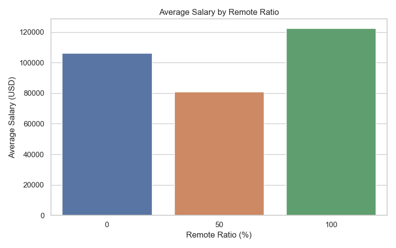
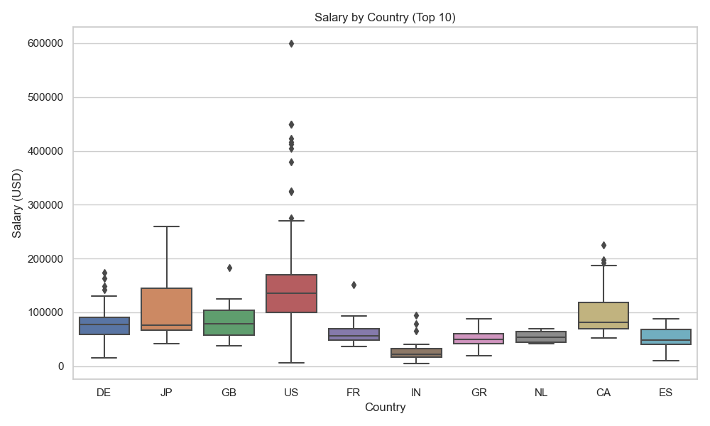

# 💼 Salary Analysis Dashboard

This project explores a dataset of data science and technology salaries from 2020 to 2023. It focuses on understanding how factors such as job title, experience level, remote work, and location affect compensation.

---

## 📊 Objectives

- Analyze salary trends across roles, levels, and countries
- Compare salaries between remote and on-site work
- Identify the highest-paying roles and job types
- Visualize results using Python (Matplotlib, Seaborn)

---

## 🧠 Key Insights

- Executive-level roles earn the highest salaries
- Fully remote roles tend to offer higher average salaries
- U.S. and Switzerland top the charts in average salary by company location
- Data Architects and ML Engineers are among the highest-paid jobs
- Wide salary range exists even within the same experience level

---

## 🛠️ Tools Used

- Python, Pandas, Matplotlib, Seaborn
- Jupyter Notebook
- Dataset: [Data Science Salaries 2023 (Kaggle)](https://www.kaggle.com/datasets/ruchi798/data-science-job-salaries)

---

## 📂 Project Structure

```
salary-analysis-dashboard/
│
├── data/
│   └── ds_salaries.csv
│
├── notebooks/
│   └── salary_analysis_eda.ipynb
│
├── visuals/
│   └── salary_by_experience.png
│   └── salary_by_remote.png
│   └── salary_by_country.png
│
├── README.md
```

---

## 📸 Visualizations

### 👤 Salary by Experience Level


### 🏠 Salary by Remote Ratio


### 🌍 Salary by Country (Top 10)



=======
# salary-analysis-dashboard
A data analysis project exploring salary trends using Python and Power BI.

